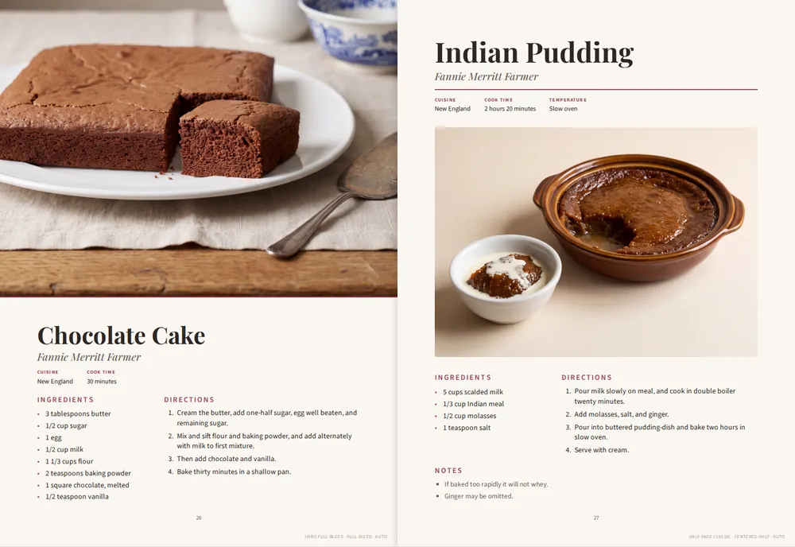
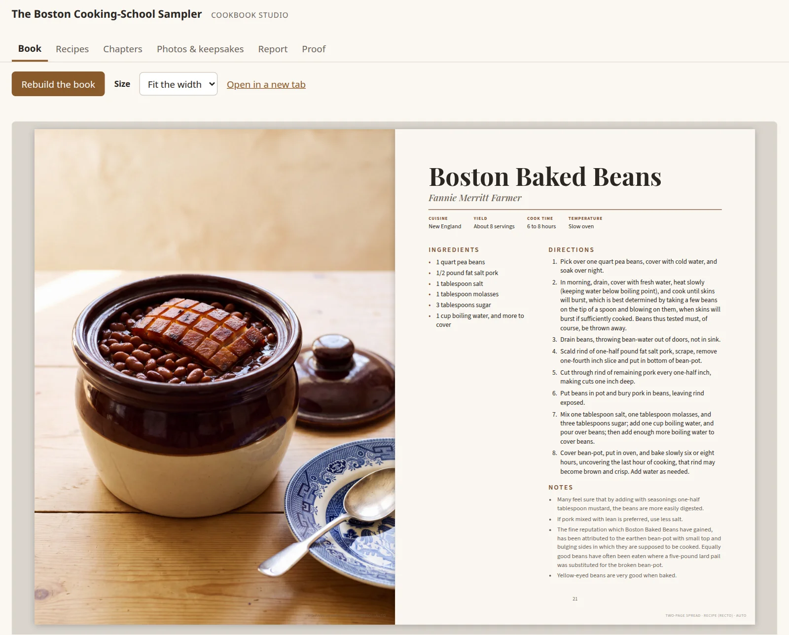

# family-cookbook

Turn a box of family recipe cards into a printed hardcover cookbook.

Take photos of the cards. AI types them up; you check each one beside its card
in your browser. The engine lays out the book, with chapters, contents,
contributors, and dish photos, and makes the two PDF files a print shop needs:
the pages and the cover. The files meet [Lulu](https://www.lulu.com)'s
specification for a US Letter (8.5 × 11 in) casewrap hardcover.



*Two pages from the example book in [`examples/fannie-farmer-1896`](examples/fannie-farmer-1896),
recipes from the 1896 Boston Cooking-School Cook Book.*

## Install

On Linux or macOS with Python 3.11 or newer:

```bash
curl -fsSL https://raw.githubusercontent.com/scanady/family-cookbook/main/install.sh | bash -s -- our-cookbook
```

This makes the folder `our-cookbook`, installs the engine and the browser it
lays out pages with (about 700 MB), starts the book, and asks for a Gemini API
key for the AI features. Press Enter to skip the key: everything still works,
and the typing is yours. It ends with `cookbook doctor`, which names anything
missing and the command that installs it. Printing also needs Ghostscript
(`sudo apt install ghostscript` or `brew install ghostscript`).

## Make the book

From the book's folder (`cd our-cookbook`):

1. **Add recipes.** Give `ingest` a photo or scan of each card, both sides in
   order, or a PDF:

   ```bash
   ./cookbook ingest card-front.jpg card-back.jpg
   ```

   AI types it up word for word and files it in a chapter. You can also write a
   recipe by hand: [RECIPE-FORMAT.md](docs/RECIPE-FORMAT.md).

2. **Check them, and see the book.**

   ```bash
   ./cookbook studio
   ```

   This opens the book in your browser. **Recipes** shows each one beside its
   card: fix what AI got wrong and approve it. **Book** shows the pages as they
   will be bound. **Chapters** reorders chapters and recipes; **Photos &
   keepsakes** adds card scans and family photos.

   

   *The studio's Book tab, open at a two-page spread from the example book.*

3. **Write the personal pages.** The dedication, each chapter's opening
   message, the closing message, and the back cover start as `TODO` lines in
   `book/`. The studio's **Report** tab lists each one; replace it with your
   own words.

4. **Add dish photos (optional).** `./cookbook photo skillet-cornbread` makes a
   photo of the finished dish with AI, or add your own.

5. **Print.** Click **Proof** in the studio, or run `./cookbook press`. It
   checks the book and writes `draft/cookbook-interior-press.pdf` and
   `draft/cookbook-cover.pdf`. If a page does not fit, it names the recipe and
   how to fix it. Upload both files to Lulu and order one proof copy first:
   [PRINTING.md](docs/PRINTING.md).

## AI

AI is on when the book's `.env` file has a key: paste a Gemini key from
[Google AI Studio](https://aistudio.google.com/apikey) after `GEMINI_API_KEY=`,
or an [OpenRouter](https://openrouter.ai/keys) key after `OPENROUTER_API_KEY=`.
Both reach the same Gemini models; OpenRouter runs on prepaid credits, with no
Google billing to set up.

Without a key, each AI command says so and carries on by hand: `ingest` files
the card's pages as a recipe for you to type up in the studio, and `photo`
makes nothing. Every AI call's cost is logged to `book/sources/ai-log.jsonl`;
a dish photo costs $0.24–$0.72, for one to three attempts.

## The five commands

| Command | What it does |
|---|---|
| `./cookbook studio` | Open the book in your browser to review, arrange, and print it. |
| `./cookbook ingest FILE...` | Add a recipe from photos, scans, or a PDF. |
| `./cookbook photo SLUG` | Make a photo of a recipe's finished dish. |
| `./cookbook press` | Make the two PDFs for the printer. |
| `./cookbook doctor` | Check what is installed and say how to fix what is not. |

The rest, the book's folder, installing by hand, and upgrading:
[COMMANDS.md](docs/COMMANDS.md). Something wrong:
[TROUBLESHOOTING.md](docs/TROUBLESHOOTING.md).

Reference: [recipes and pages](docs/RECIPE-FORMAT.md) ·
[book.yaml](docs/BOOK-YAML.md) · [page layouts](docs/LAYOUTS.md) ·
[printing at Lulu](docs/PRINTING.md)

## Help and contributing

Ask questions and report bugs in
[GitHub Issues](https://github.com/scanady/family-cookbook/issues). Pull
requests are not accepted for now; see [CONTRIBUTING.md](CONTRIBUTING.md). How
the engine is organized is in [AGENTS.md](AGENTS.md). To run the tests from a
clone:

```bash
python -m venv .venv && .venv/bin/pip install -e ".[test]"
.venv/bin/python -m playwright install chromium
.venv/bin/python -m pytest
```

## License

[PolyForm Noncommercial 1.0.0](LICENSE). You may use, change, and share the
engine for any noncommercial purpose, including making your own family's
cookbook and printing copies for your family. Commercial use needs a separate
license: contact the author through [GitHub](https://github.com/scanady).

The bundled Playfair Display and Source Sans 3 fonts are under the SIL Open
Font License ([`src/family_cookbook/fonts/`](src/family_cookbook/fonts/)).
