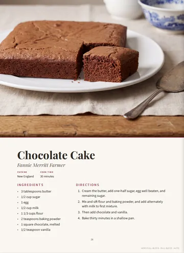
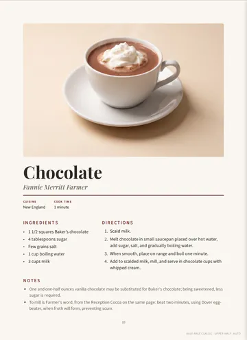
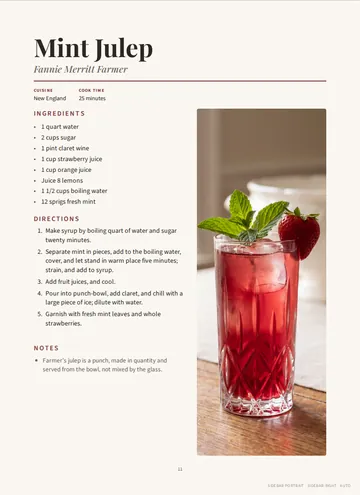
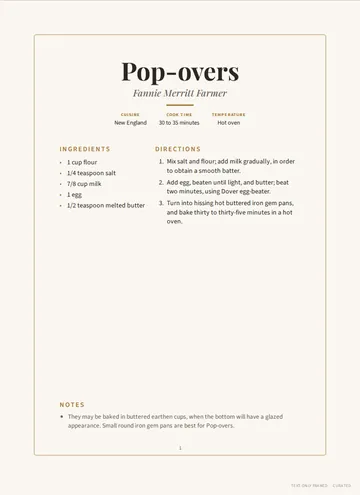
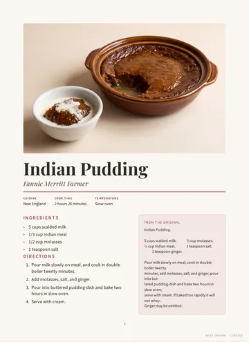
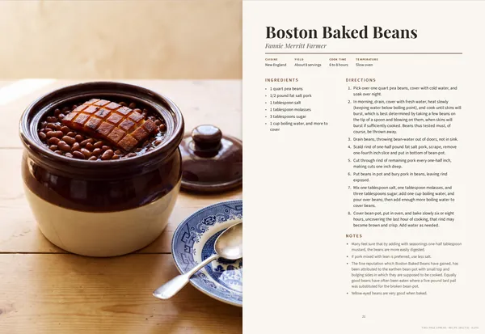
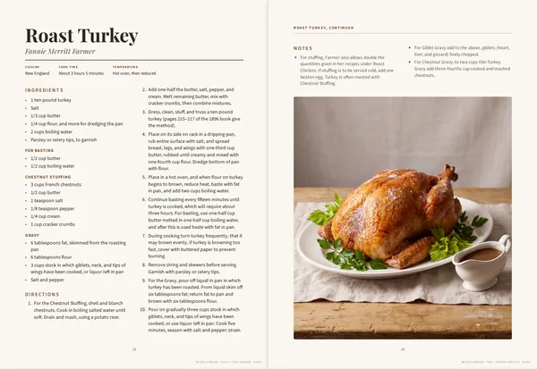
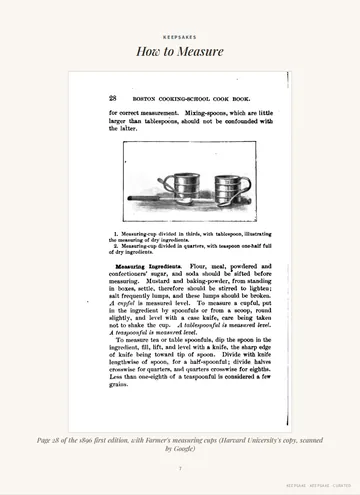

# Page layouts

Every entry prints in one of seven layouts (the engine's code and `book.yaml`
call them *archetypes*). The engine picks one for each entry when it builds the
book. You can choose one yourself with a `layouts:` row in `book/book.yaml`.

The screen draft labels each page at its foot with its layout, where the photo
sits, and who chose the layout: `AUTO` (the engine), `CURATED` (a `layouts:` row
in `book.yaml`), or `FIXED` (a page whose kind always takes the same layout: the
title page, contents, chapter opening pages, keepsake pages, blank pages). For
example: `HALF-PAGE CLASSIC · UPPER-HALF · AUTO`. The `Pages:` line `cookbook
build` prints gives the same three counts, such as `curated: 2, fixed: 10,
auto: 18`. The labels do not appear in the print files.

The pictures below come from the example book in `examples/fannie-farmer-1896`.

## The seven layouts

### Hero Full-Bleed



The photo fills the top of the page and runs off its edges. The title and
recipe sit on a panel below it. The photo takes the height the recipe leaves,
from 5 to 7.25 inches. Best for a short recipe with a striking photo.

### Half-Page Classic



A band of photo across the text column, 3 to 6.75 inches tall: the shorter the
recipe, the taller the photo. The zone sets where the band goes:

| `zone` contains | Photo |
|---|---|
| `upper` | above the title |
| `lower` | at the foot of the page |
| anything else | between the title and the recipe |

### Sidebar Portrait



The recipe in one column beside a tall, narrow photo. It suits a standing
subject, such as a glass, a mug, or a tall cake, and a recipe long enough to
fill the column beside it. The photo is on the right, or on the left when the
zone contains `left`.

### Text-Only Framed



No photo: the title centered, the recipe inside a thin frame. Chapter opening
pages, prose entries without a photo, and recipes without a photo that fit on
one page use it. A prose page too long for one page continues onto the next.
Choosing it for a recipe that has a photo leaves the photo out.

### Inset Original



A photo band, then the recipe beside a box headed *From the original* that
holds the word-for-word text of `sources/recipe-original.md`
([RECIPE-FORMAT.md](RECIPE-FORMAT.md#the-original-sourcesrecipe-originalmd)).
The engine never picks it automatically. Choose it for a recipe whose
original wording is worth showing, and keep the original short enough to fit.

### Two-Page Spread



Two facing pages: the photo fills the left-hand page, and the whole recipe
sits at full size on the right-hand page.

### Recipe Spread



A recipe too long for one page of text, set across two facing pages in four
columns. The photo takes the room left at the foot of the right-hand page. A
step, an ingredient, or a note is never split between columns.

### Keepsake pages



Not a layout you choose: a page the engine adds after an entry to hold its
keepsakes ([RECIPE-FORMAT.md](RECIPE-FORMAT.md#keepsakes-extras)).

## How the engine chooses

The engine goes through each chapter in order and picks a layout for every
entry that has no `layouts:` row:

1. **Chapter opening pages** always use Text-Only Framed.
2. **Prose entries** without a photo use Text-Only Framed.
3. **Recipes without a photo** use Text-Only Framed if the recipe fits on one
   page at full type size, and the Recipe Spread if it does not.
4. **Entries with a photo** try Sidebar Portrait first, then take the next
   layout in this rotation:

   | Turn | Layout | Zone |
   |---|---|---|
   | 1 | Half-Page Classic | `upper-half` |
   | 2 | Sidebar Portrait | `sidebar-right` |
   | 3 | Half-Page Classic | `lower-half` |
   | 4 | Hero Full-Bleed | `full-bleed` |
   | 5 | Half-Page Classic | `centered-half` |
   | 6 | Sidebar Portrait | `sidebar-left` |

   A layout is used only if the recipe fits it at full type size and its photo
   frame shows the dish whole. No page repeats the look of the page before it.
   If the text fits but no frame suits the photo, the engine takes the band or
   hero that shows the most of the food: a photo never costs a second page.
5. **A recipe too long for any one-page layout** takes two pages: the Two-Page
   Spread if the recipe fits one full page of text and its photo suits a full
   page, otherwise the Recipe Spread. Two facing pages are the most one recipe
   can take: a recipe too long for the Recipe Spread prints with smaller text,
   and `cookbook check` fails it until it is shortened.

Two-page layouts always start on a left-hand page, so the pair faces across
the binding. When one would start on a right-hand page, the engine moves the
chapter's next one-page recipe in front of it, or adds a blank page if there is
none. Chapter dividers always start on a right-hand page. That is why a book
has a few blank pages.

Adding, removing, or editing an entry can change the layouts of the entries
after it in the same chapter. Choose a layout in `book.yaml` for any page you
want to stay put.

## Choosing a layout yourself

Add a row to `layouts:` in `book/book.yaml`
([full reference](BOOK-YAML.md#layouts)):

```yaml
layouts:
  - chapter: desserts
    slug: apple-pie
    archetype: Hero Full-Bleed
  - chapter: breakfast
    slug: buttermilk-pancakes
    archetype: Half-Page Classic
    zone: lower-half
  - chapter: beverages
    slug: lemonade
    archetype: Sidebar Portrait
    zone: sidebar-left
```

Then look at the page and check it still fits:

```bash
cookbook build --only apple-pie       # just that entry, in draft/cookbook-draft.html
cookbook build --print && cookbook check
```

`--only` replaces `draft/cookbook-draft.html` with just those entries. Run
`cookbook build` again to see the whole book.

The engine follows your choice even when the recipe does not fit. If a page
holds too much, its text shrinks to fit. `cookbook check` fails when text runs
past the edge of a page or reading text would print below 10 pt. It names the
entry on each failing page and says how to fix it: choose a two-page layout, a
layout with a smaller photo, or shorten the recipe (trim it, or move stories
from its Notes into the original, `sources/recipe-original.md`, which keeps
them without printing them). A recipe already on two pages can only be
shortened: two facing pages are the most one recipe can take.

## Photo crops

The engine finds the dish in each photo and crops around it for the frame the
layout uses. When it misjudges, either:

- add `- **Image position:** top`, `center`, or `bottom` to the recipe's
  details. It sets which part of the photo a crop keeps from top to bottom; or
- choose a layout whose frame suits the photo (a tall photo of a glass suits
  Sidebar Portrait; a wide platter suits a band or the hero).

`cookbook fit` lists every photo too small to print crisply where it lands and
every frame that cuts the dish. `cookbook press` runs it first.
