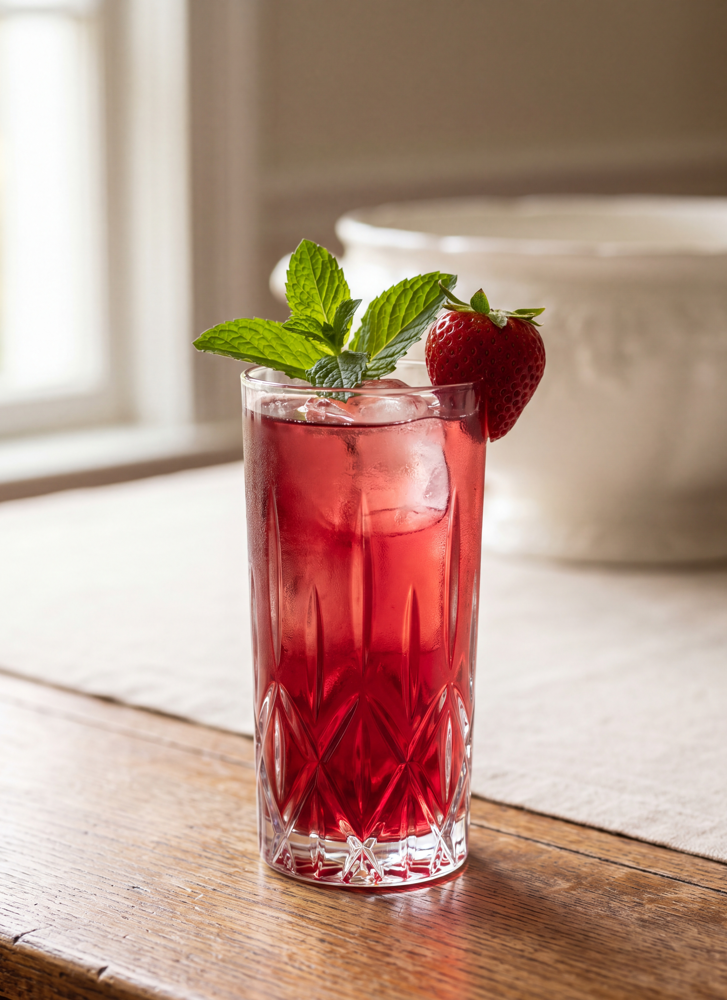

# Mint Julep

*Fannie Merritt Farmer*

- **Category:** Beverages
- **Cuisine:** New England
- **Yield:** Not specified
- **Prep time:** Not specified
- **Cook time:** 25 minutes
- **Temperature:** Not specified

## Ingredients

- 1 quart water
- 2 cups sugar
- 1 pint claret wine
- 1 cup strawberry juice
- 1 cup orange juice
- Juice 8 lemons
- 1 1/2 cups boiling water
- 12 sprigs fresh mint

## Directions

1. Make syrup by boiling quart of water and sugar twenty minutes.
2. Separate mint in pieces, add to the boiling water, cover, and let stand in warm place five minutes; strain, and add to syrup.
3. Add fruit juices, and cool.
4. Pour into punch-bowl, add claret, and chill with a large piece of ice; dilute with water.
5. Garnish with fresh mint leaves and whole strawberries.

## Notes

- Farmer's julep is a punch, made in quantity and served from the bowl, not mixed by the glass.

[View the original recipe](sources/recipe-original.md)
