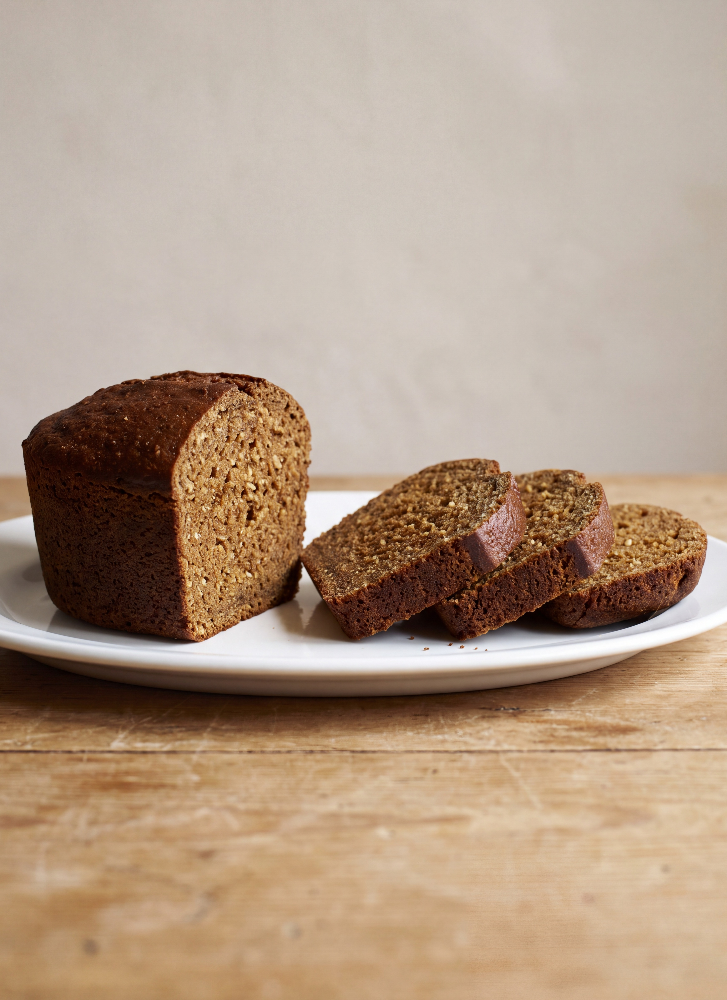

# Boston Brown Bread

*Fannie Merritt Farmer*

- **Category:** Breads & Breakfast Cakes
- **Cuisine:** New England
- **Yield:** Not specified
- **Prep time:** Not specified
- **Cook time:** 3 hours 30 minutes
- **Temperature:** Not specified

## Ingredients

- 1 cup rye-meal
- 1 cup granulated corn-meal
- 1 cup Graham flour
- 3/4 tablespoon soda
- 1 teaspoon salt
- 3/4 cup molasses
- 2 cups sour milk, or 1 3/4 cups sweet milk or water

## Directions

1. Mix and sift dry ingredients, add molasses and milk, and stir until well mixed.
2. Turn into a well-buttered mould. Mould should never be filled more than two-thirds full.
3. Butter the cover before placing it on mould, and then tie it down with string; otherwise the bread in rising might force off cover.
4. For steaming, place mould on a trivet in kettle containing boiling water, allowing water to come half-way up around mould.
5. Cover closely, and steam three and one-half hours, adding, as needed, more boiling water.

## Notes

- A melon-mould or one-pound baking-powder boxes make the most attractive-shaped loaves, but a five-pound lard pail answers the purpose.

[View the original recipe](sources/recipe-original.md)
