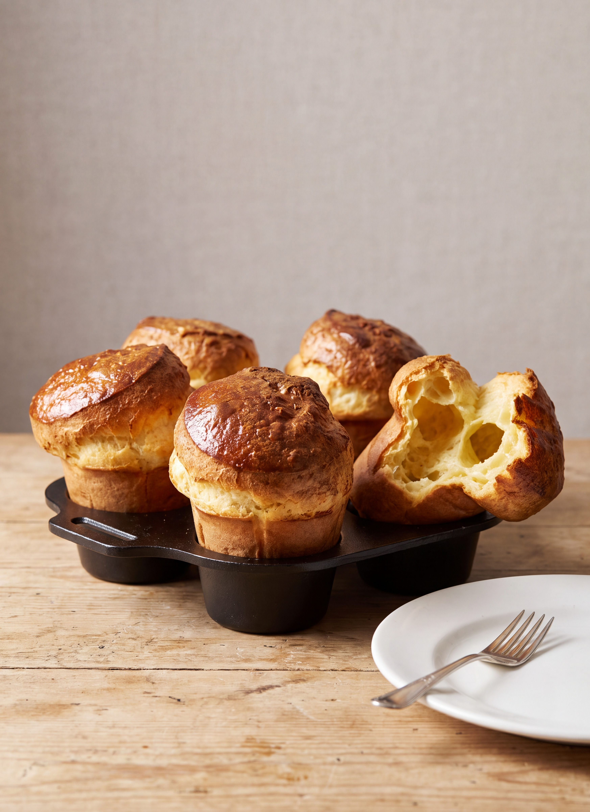

# Pop-overs

*Fannie Merritt Farmer*

- **Category:** Breads & Breakfast Cakes
- **Cuisine:** New England
- **Yield:** Not specified
- **Prep time:** Not specified
- **Cook time:** 30 to 35 minutes
- **Temperature:** Hot oven

## Ingredients

- 1 cup flour
- 1/4 teaspoon salt
- 7/8 cup milk
- 1 egg
- 1/2 teaspoon melted butter

## Directions

1. Mix salt and flour; add milk gradually, in order to obtain a smooth batter.
2. Add egg, beaten until light, and butter; beat two minutes, using Dover egg-beater.
3. Turn into hissing hot buttered iron gem pans, and bake thirty to thirty-five minutes in a hot oven.

## Notes

- They may be baked in buttered earthen cups, when the bottom will have a glazed appearance. Small round iron gem pans are best for Pop-overs.

[View the original recipe](sources/recipe-original.md)
