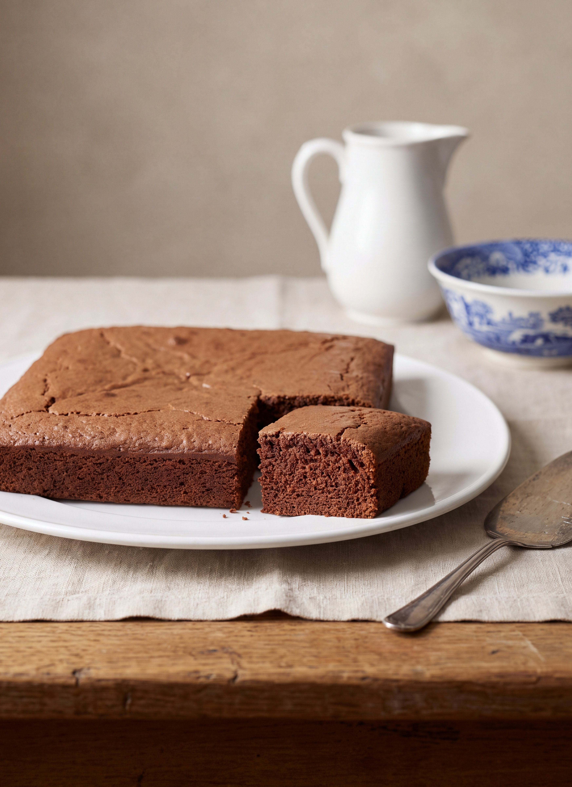

# Chocolate Cake

*Fannie Merritt Farmer*

- **Category:** Desserts
- **Cuisine:** New England
- **Yield:** Not specified
- **Prep time:** Not specified
- **Cook time:** 30 minutes
- **Temperature:** Not specified

## Ingredients

- 3 tablespoons butter
- 1/2 cup sugar
- 1 egg
- 1/2 cup milk
- 1 1/3 cups flour
- 2 teaspoons baking powder
- 1 square chocolate, melted
- 1/2 teaspoon vanilla

## Directions

1. Cream the butter, add one-half sugar, egg well beaten, and remaining sugar.
2. Mix and sift flour and baking powder, and add alternately with milk to first mixture.
3. Then add chocolate and vanilla.
4. Bake thirty minutes in a shallow pan.

[View the original recipe](sources/recipe-original.md)
