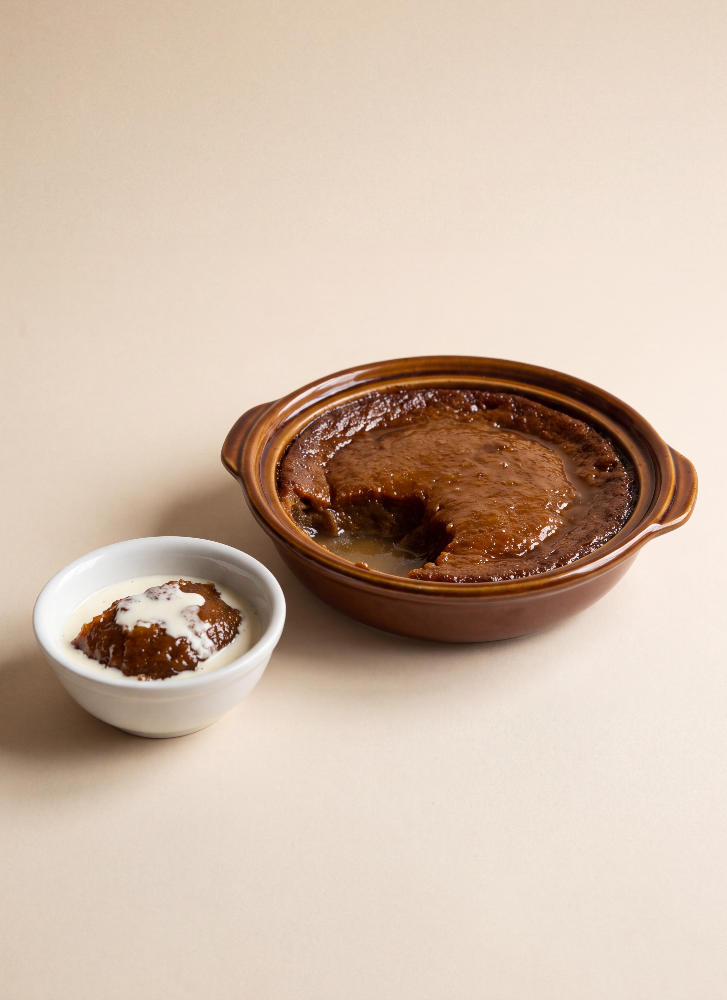

# Indian Pudding

*Fannie Merritt Farmer*

- **Category:** Desserts
- **Cuisine:** New England
- **Yield:** Not specified
- **Prep time:** Not specified
- **Cook time:** 2 hours 20 minutes
- **Temperature:** Slow oven

## Ingredients

- 5 cups scalded milk
- 1/3 cup Indian meal
- 1/2 cup molasses
- 1 teaspoon salt

## Directions

1. Pour milk slowly on meal, and cook in double boiler twenty minutes.
2. Add molasses, salt, and ginger.
3. Pour into buttered pudding-dish and bake two hours in slow oven.
4. Serve with cream.

## Notes

- If baked too rapidly it will not whey.
- Ginger may be omitted.

[View the original recipe](sources/recipe-original.md)
