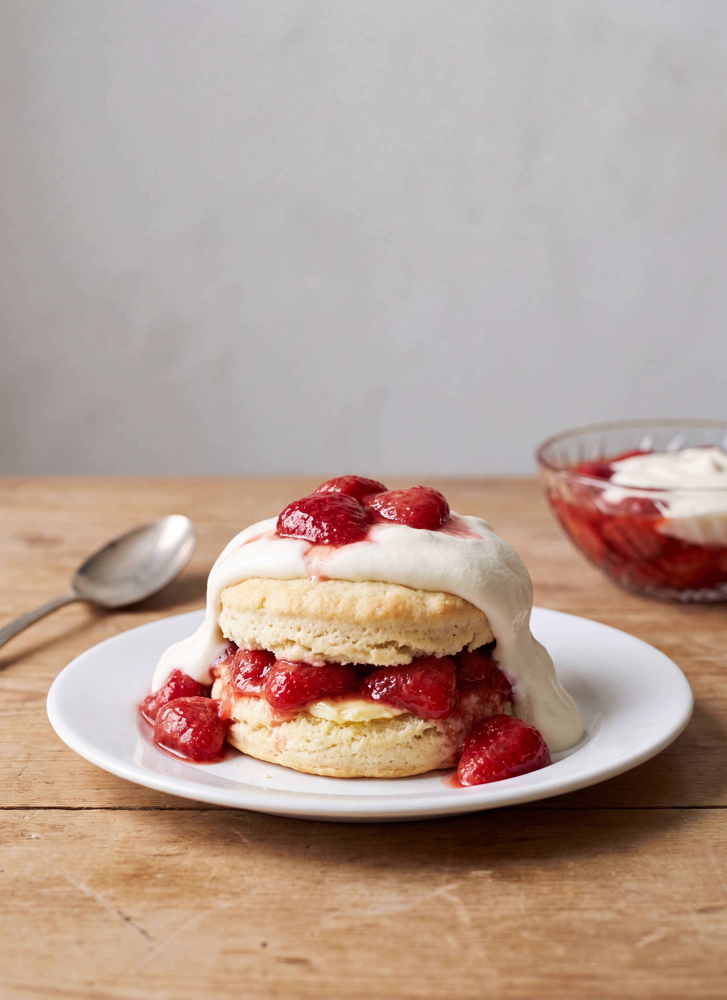

# Strawberry Short Cake

*Fannie Merritt Farmer*

- **Category:** Desserts
- **Cuisine:** New England
- **Yield:** Not specified
- **Prep time:** Not specified
- **Cook time:** 12 minutes
- **Temperature:** Hot oven

## Ingredients

- 2 cups flour
- 3 teaspoons baking powder
- 1/2 teaspoon salt
- 2 teaspoons sugar
- 3/4 cup milk
- 1/4 cup butter, and more for spreading
- 1 to 1 1/2 boxes strawberries for each Short Cake
- Sugar, to sweeten the berries

**Cream Sauce I:**
- 3/4 cup thick cream
- 1/4 cup milk
- 1/3 cup powdered sugar
- 1/2 teaspoon vanilla

## Directions

1. Mix dry ingredients, sift twice, work in butter with tips of fingers, and add milk gradually.
2. Toss on floured board, divide in two parts. Pat, roll out, and bake twelve minutes in a hot oven in buttered Washington pie or round layer cake tins.
3. Split and spread with butter.
4. Sweeten strawberries to taste, place on back of range until warmed, crush slightly, and put between and on top of Short Cakes.
5. For Cream Sauce I, mix cream and milk, beat until stiff, using egg beater; add sugar and vanilla.
6. Cover top with Cream Sauce I.

[View the original recipe](sources/recipe-original.md)
