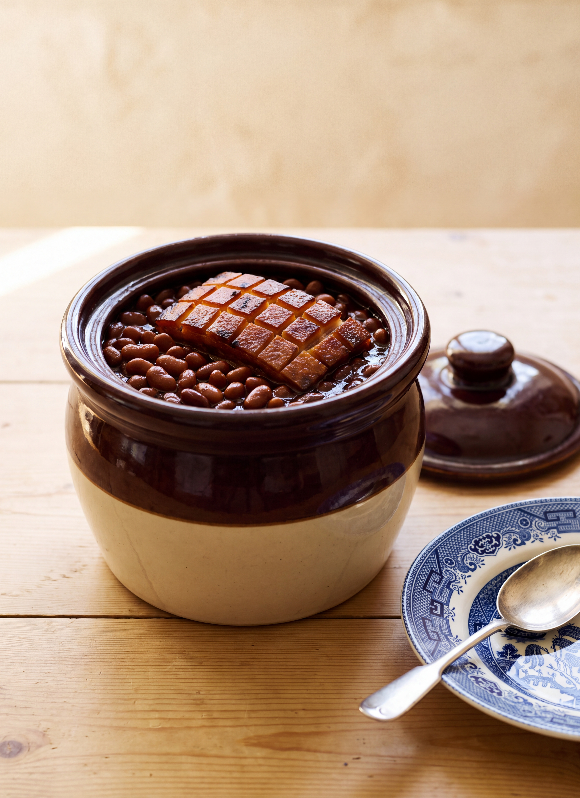

# Boston Baked Beans

*Fannie Merritt Farmer*

- **Category:** Meat & Poultry
- **Cuisine:** New England
- **Yield:** About 8 servings
- **Prep time:** Not specified
- **Cook time:** 6 to 8 hours
- **Temperature:** Slow oven

## Ingredients

- 1 quart pea beans
- 1/2 pound fat salt pork
- 1 tablespoon salt
- 1 tablespoon molasses
- 3 tablespoons sugar
- 1 cup boiling water, and more to cover

## Directions

1. Pick over one quart pea beans, cover with cold water, and soak over night.
2. In morning, drain, cover with fresh water, heat slowly (keeping water below boiling point), and cook until skins will burst, which is best determined by taking a few beans on the tip of a spoon and blowing on them, when skins will burst if sufficiently cooked. Beans thus tested must, of course, be thrown away.
3. Drain beans, throwing bean-water out of doors, not in sink.
4. Scald rind of one-half pound fat salt pork, scrape, remove one-fourth inch slice and put in bottom of bean-pot.
5. Cut through rind of remaining pork every one-half inch, making cuts one inch deep.
6. Put beans in pot and bury pork in beans, leaving rind exposed.
7. Mix one tablespoon salt, one tablespoon molasses, and three tablespoons sugar; add one cup boiling water, and pour over beans; then add enough more boiling water to cover beans.
8. Cover bean-pot, put in oven, and bake slowly six or eight hours, uncovering the last hour of cooking, that rind may become brown and crisp. Add water as needed.

## Notes

- Many feel sure that by adding with seasonings one-half tablespoon mustard, the beans are more easily digested.
- If pork mixed with lean is preferred, use less salt.
- The fine reputation which Boston Baked Beans have gained, has been attributed to the earthen bean-pot with small top and bulging sides in which they are supposed to be cooked. Equally good beans have often been eaten where a five-pound lard pail was substituted for the broken bean-pot.
- Yellow-eyed beans are very good when baked.

[View the original recipe](sources/recipe-original.md)
