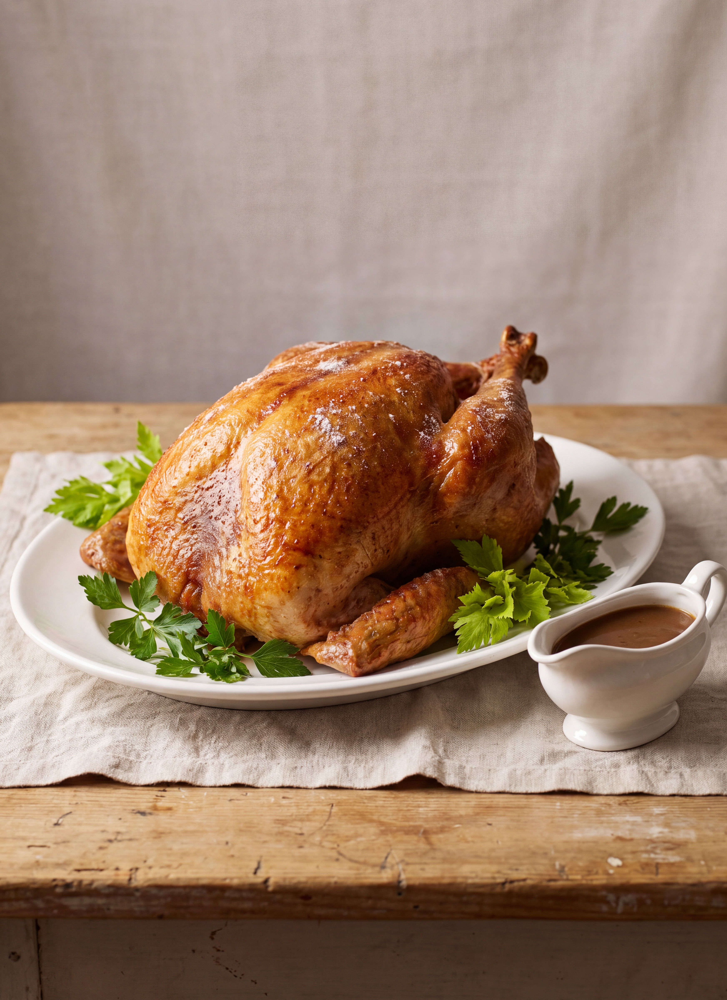

# Roast Turkey

*Fannie Merritt Farmer*

- **Category:** Meat & Poultry
- **Cuisine:** New England
- **Yield:** Not specified
- **Prep time:** Not specified
- **Cook time:** About 3 hours 5 minutes
- **Temperature:** Hot oven, then reduced

## Ingredients

- 1 ten-pound turkey
- Salt
- 1/3 cup butter
- 1/4 cup flour, and more for dredging the pan
- 2 cups boiling water
- Parsley or celery tips, to garnish

**For Basting:**
- 1/2 cup butter
- 1/2 cup boiling water

**Chestnut Stuffing:**
- 3 cups French chestnuts
- 1/2 cup butter
- 1 teaspoon salt
- 1/8 teaspoon pepper
- 1/4 cup cream
- 1 cup cracker crumbs

**Gravy:**
- 6 tablespoons fat, skimmed from the roasting pan
- 6 tablespoons flour
- 3 cups stock in which giblets, neck, and tips of wings have been cooked, or liquor left in pan
- Salt and pepper

## Directions

1. For the Chestnut Stuffing, shell and blanch chestnuts. Cook in boiling salted water until soft. Drain and mash, using a potato ricer.
2. Add one-half the butter, salt, pepper, and cream. Melt remaining butter, mix with cracker crumbs, then combine mixtures.
3. Dress, clean, stuff, and truss a ten-pound turkey (pages 215–217 of the 1896 book give the method).
4. Place on its side on rack in a dripping-pan, rub entire surface with salt, and spread breast, legs, and wings with one-third cup butter, rubbed until creamy and mixed with one-fourth cup flour. Dredge bottom of pan with flour.
5. Place in a hot oven, and when flour on turkey begins to brown, reduce heat, baste with fat in pan, and add two cups boiling water.
6. Continue basting every fifteen minutes until turkey is cooked, which will require about three hours. For basting, use one-half cup butter melted in one-half cup boiling water, and after this is used baste with fat in pan.
7. During cooking turn turkey frequently, that it may brown evenly. If turkey is browning too fast, cover with buttered paper to prevent burning.
8. Remove string and skewers before serving. Garnish with parsley or celery tips.
9. For the Gravy, pour off liquid in pan in which turkey has been roasted. From liquid skim off six tablespoons fat; return fat to pan and brown with six tablespoons flour.
10. Pour on gradually three cups stock in which giblets, neck, and tips of wings have been cooked, or use liquor left in pan. Cook five minutes, season with salt and pepper; strain.

## Notes

- For stuffing, Farmer also allows double the quantities given in her recipes under Roast Chicken. If stuffing is to be served cold, add one beaten egg. Turkey is often roasted with Chestnut Stuffing.
- For Giblet Gravy add to the above, giblets (heart, liver, and gizzard) finely chopped.
- For Chestnut Gravy, to two cups thin Turkey Gravy add three-fourths cup cooked and mashed chestnuts.

[View the original recipe](sources/recipe-original.md)
