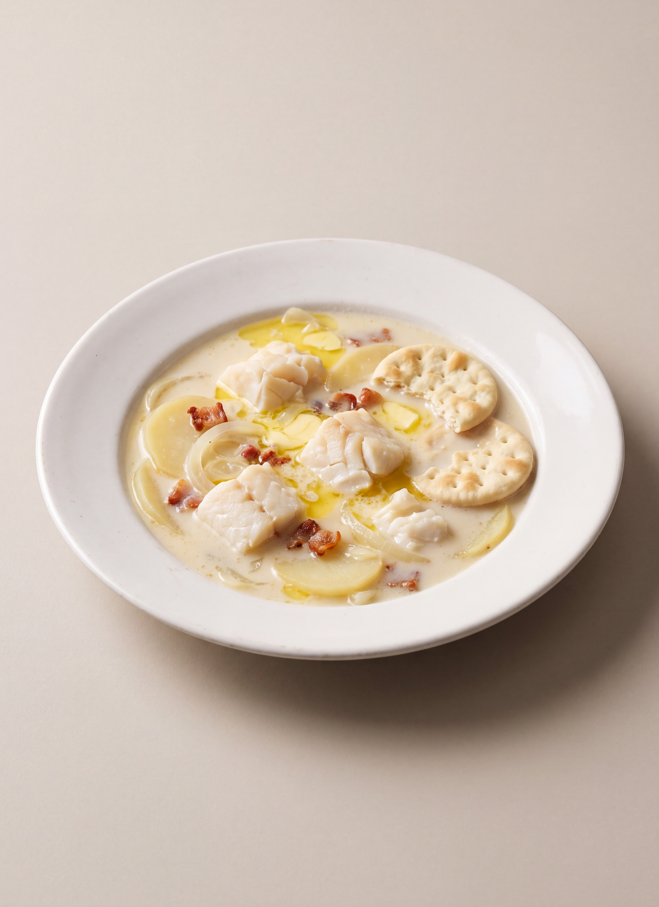

# Fish Chowder

*Fannie Merritt Farmer*

- **Category:** Soups & Chowders
- **Cuisine:** New England
- **Yield:** Not specified
- **Prep time:** Not specified
- **Cook time:** 20 minutes
- **Temperature:** Not specified

## Ingredients

- 4 lb. cod or haddock
- 6 cups potatoes cut in 1/4 inch slices, or 4 cups potatoes cut in 3/4 inch cubes
- 1 sliced onion
- 1 1/2 inch cube fat salt pork
- 1 tablespoon salt
- 1/8 teaspoon pepper
- 3 tablespoons butter
- 4 cups scalded milk
- 8 common crackers, or pilot bread

## Directions

1. Order the fish skinned, but head and tail left on.
2. Cut off head and tail and remove fish from backbone. Cut fish in two-inch pieces and set aside.
3. Put head, tail, and backbone broken in pieces, in stewpan; add two cups cold water and bring slowly to boiling point; cook twenty minutes.
4. Cut salt pork in small pieces and try out, add onion, and fry five minutes; strain fat into stewpan.
5. Parboil potatoes five minutes in boiling water to cover; drain, and add potatoes to fat; then add two cups boiling water and cook five minutes.
6. Add liquor drained from bones and fish; cover, and simmer ten minutes.
7. Add milk, salt, pepper, butter, and crackers split and soaked in enough cold milk to moisten.

[View the original recipe](sources/recipe-original.md)
